
 SmartUs 

# 👩🏻 Team Name

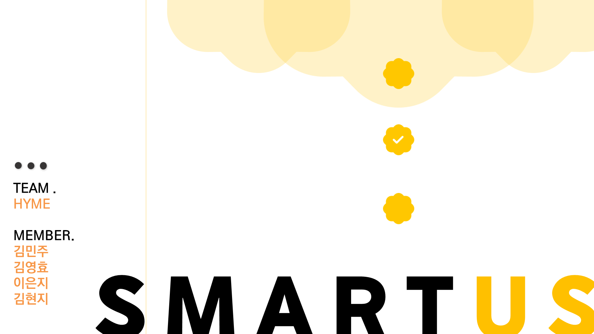

# 📚 Theme

  

🌟 특별 세션 - 스마트 기술 교육 부재

 
 

# 💡Intro

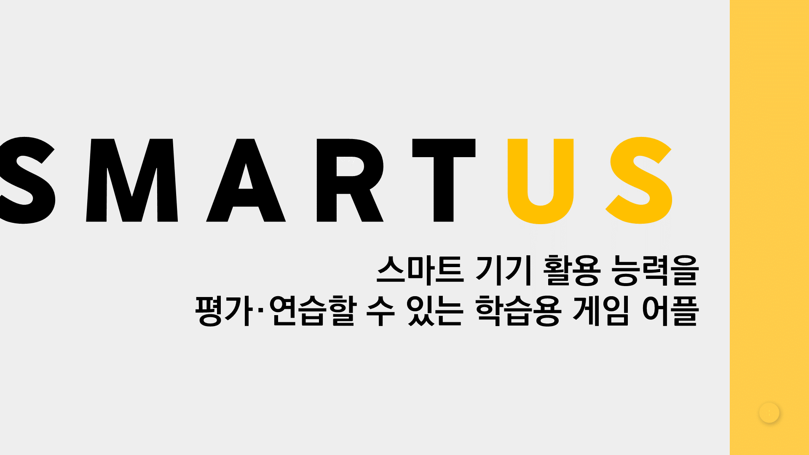

 
 

# 💡Explain

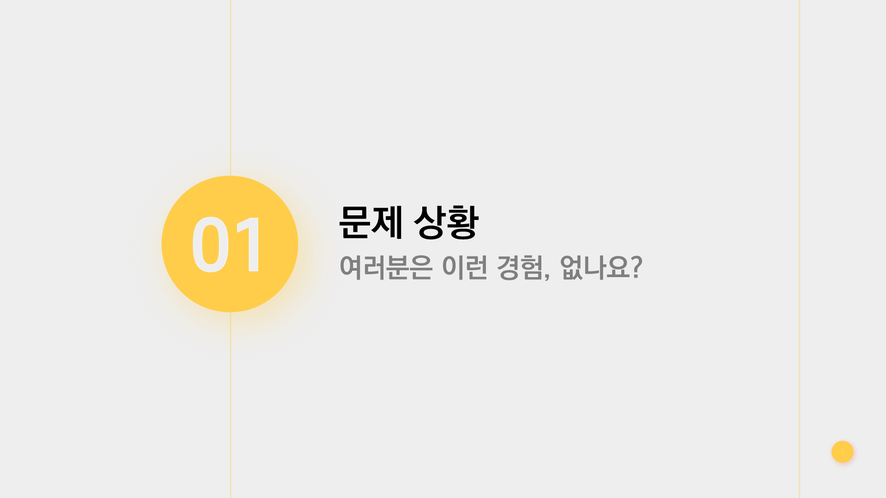

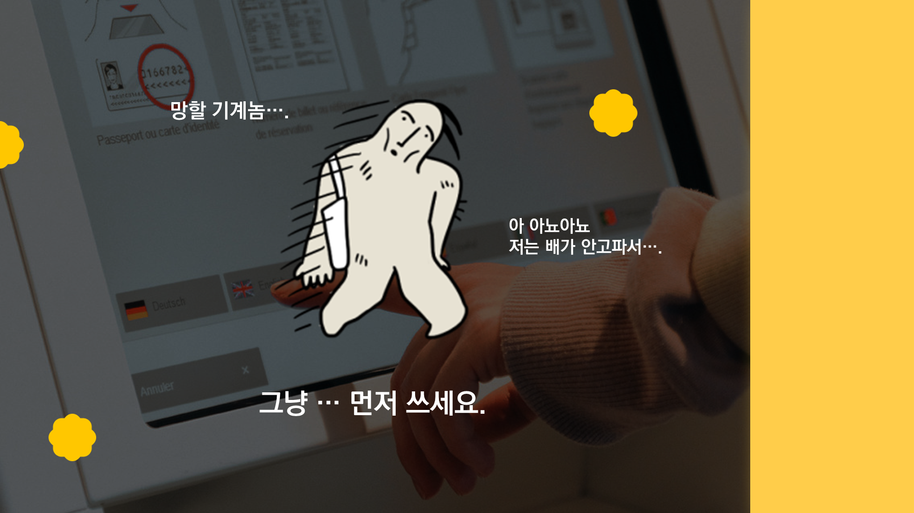

 
 

<h2>📎메인 메뉴 선택 화면</h2>

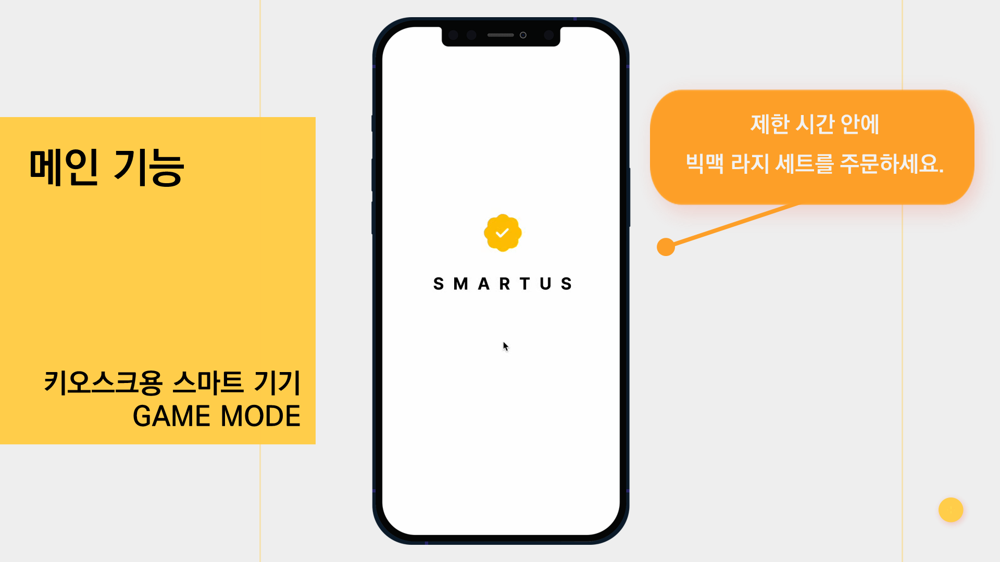

 
 

<h4 align="center">💡 - 키오스크 외의 다양한 스마트 기기들을 선택할 수 있습니다.</h4>

 
 

<h2>📎키오스크 브랜드 선택 화면</h2>

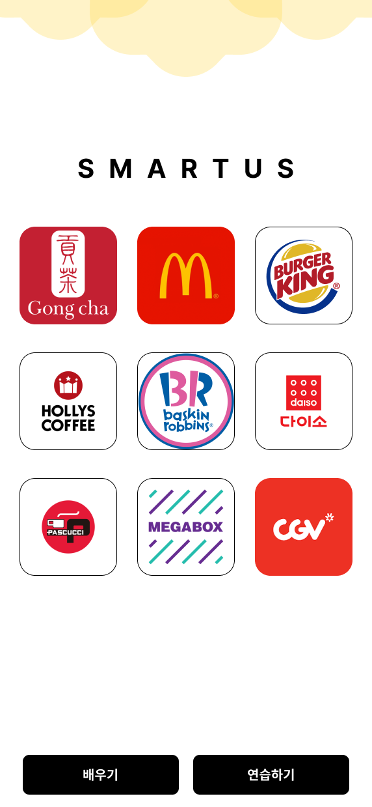

<h4 align="center">💡 - 키오스크의 여러 브랜드를 선택하고, 'Game (연습하기)' & 'Guide (배우기)' 두 가지 모드로 실행할 수 있습니다.</h4>

 
 

<h2>🎮 Game Mode : 미션 안내</h2>

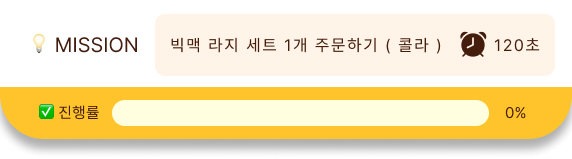

<h4 align="center">💡 - 미션 탭이 상단에 등장하게 되고 제한 시간 타이머가 실행됩니다.</h4>

 
 

<h2>🎮 키오스크 게임 진행</h2>

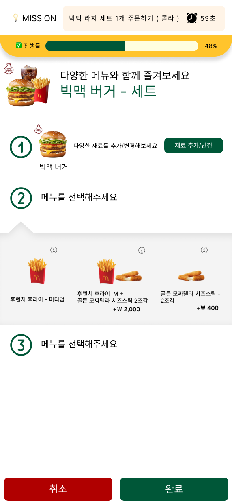

<h4 align="center">💡 - 실제 키오스크와 똑같은 Ui/Ux 를 직접 만져보며 실행할 수 있습니다.</h4>

 
 

<h2>🎮 키오스크 게임 최종 화면</h2>

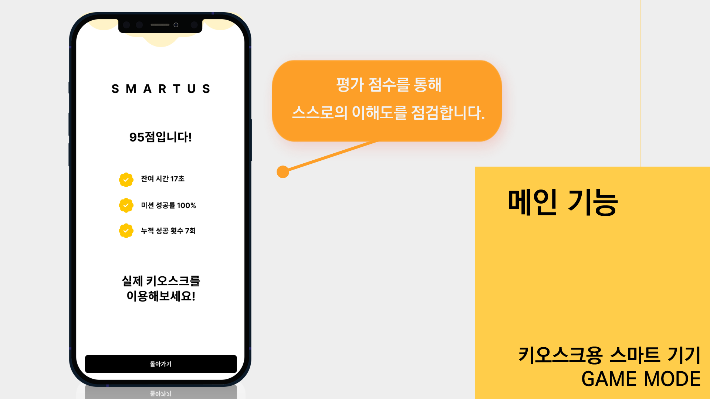

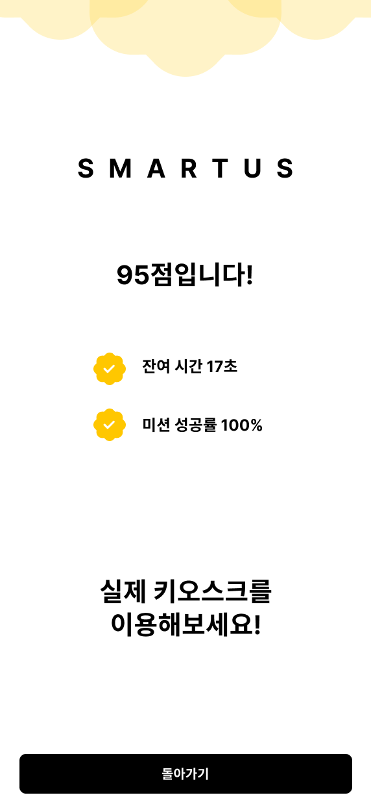

<h4 align="center">💡 - 잔여 시간과 달성률을 기반으로 미션 수행도를 평가하고, 일정 점수에 따라 평가 코멘트를 작성합니다.</h4>
  
 
 

<h2>📚 키오스크 가이드 (배우기) 화면</h2>

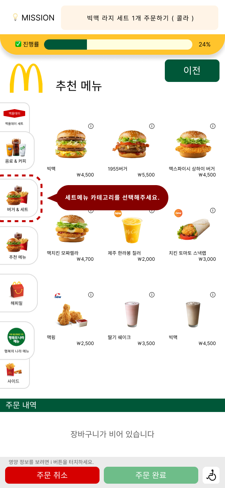

<h4 align="center">💡 - 키오스크를 아예 처음 접하는 사람을 위해 수행해야하는 액션을 가르쳐주는 가이드 모드가 존재합니다.</h4>

 
 

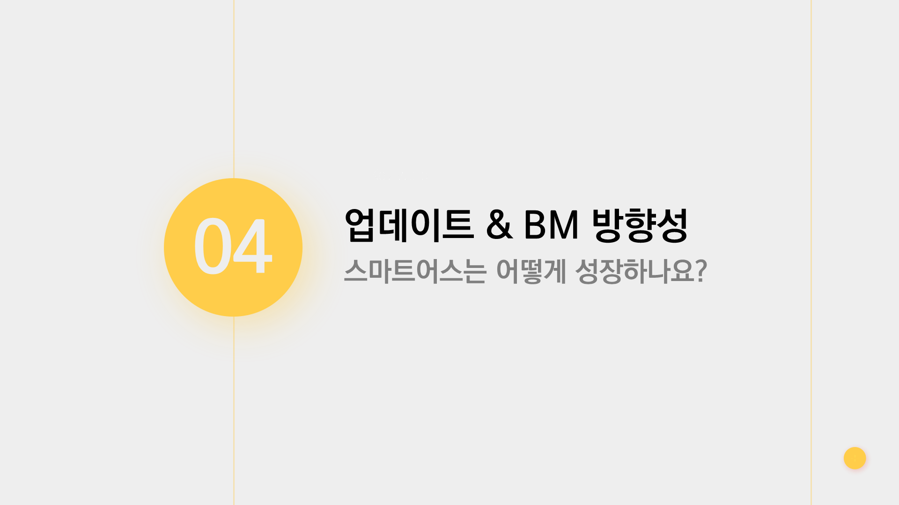

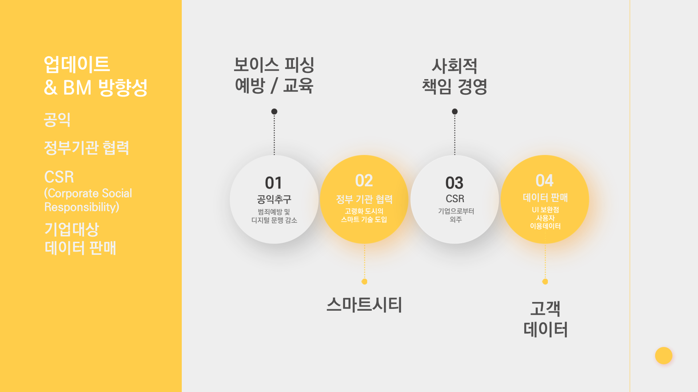

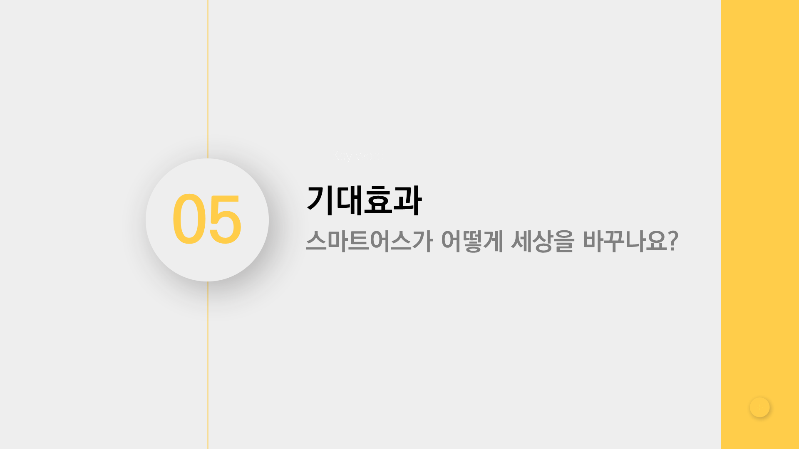

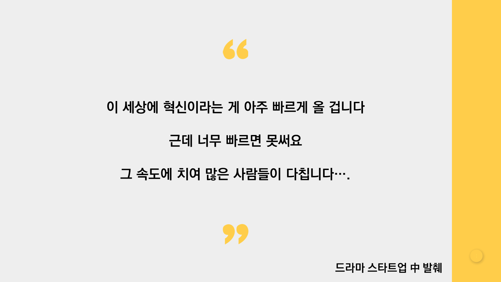

# 🔧Tech
<h3>✦ 자바 스크립트 활용</h3>
**- 배열 사용 , timer 사용한 시간 제한 기능

<h3>✦ 배포 및 호스팅</h3>
**- git.io 를 통한 배포로 모든 사람이 손쉽게 접근 가능한 프로덕트 구현

<h3>✦ [추가예정]</h3>
**- Apps Script 활용해 사용자의 기본 정보 체크
**- 업데이트 일괄 알림 (메일 or 전화번호로)

 
 

# 💻Video

 
 

