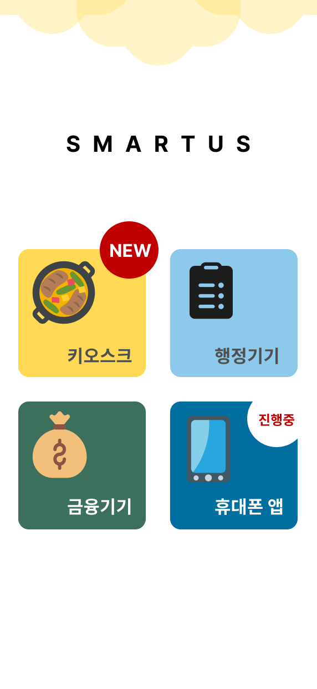

 SmartUs 

  
  

# 👩🏻 Team Name

# 📚 Theme
🌟 특별 세션 - 스마트 기술 교육 부재

# 💡Intro
각종 스마트 기기의 UI/UX 데이터 활용, 미션을 수행하는 교육용 게임 웹앱

# 💡Explain
{: width="50px" height="100px" }

# 🔧Tech
자바 스크립트 활용
- 배열 사용 , timer 사용한 시간 제한 기능

배포 및 호스팅
- git.io 를 통한 배포로 모든 사람이 손쉽게 접근 가능한 프로덕트 구현

자바스크립트 [추가예정]
- Apps Script 활용해 사용자의 기본 정보 체크
- 업데이트 일괄 알림 (메일 or 전화번호로)

# 💻Video

## Wave <a id="wave">

## Egg <a id="egg">

## Shark <a id="shark">

## Slice <a id="slice">

  
## Rect <a id="rect">

## Soft <a id="soft">

## Rounded <a id="rounded">

## Cylinder <a id="cylinder">

## Waving <a id="waving">

## Transparent <a id="transparent">

# Things that helped contribute

- SVG Path Easy Maker [Codepen](https://codepen.io/kyechan99/pen/yLeQVBa)
- SVG Path draw [mavo.io](https://mavo.io/demos/svgpath/)

